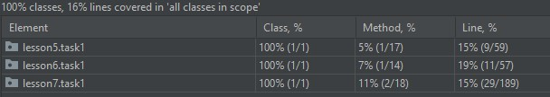
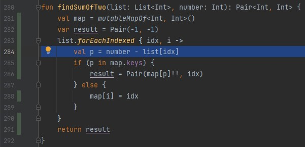
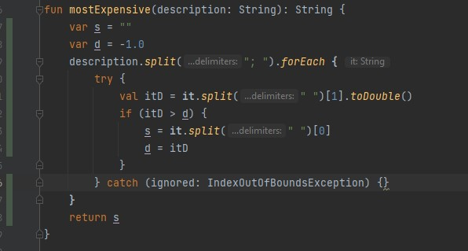
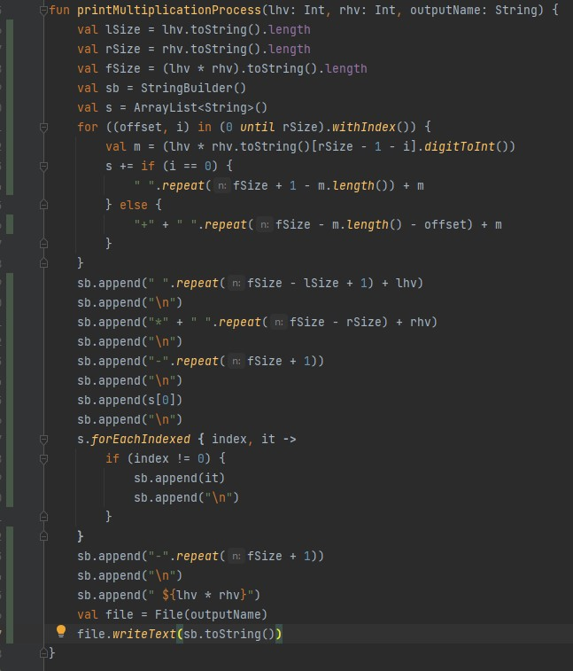

## Test coverage results

the test has been realized on 3 exercises in 3 different files

on the result, we can see the percentage of classes, methods and lines executed during the test,
the number of methods and lines of code executed seems low, this is due to the fact that the 
test was performed on only one exercise per class (those written by myself) while the classes 
contain several others exercises

### the code that has been executed or covered by tests: 
 we can see that all lines in methods has been covered
 
 
 
 
 
 
